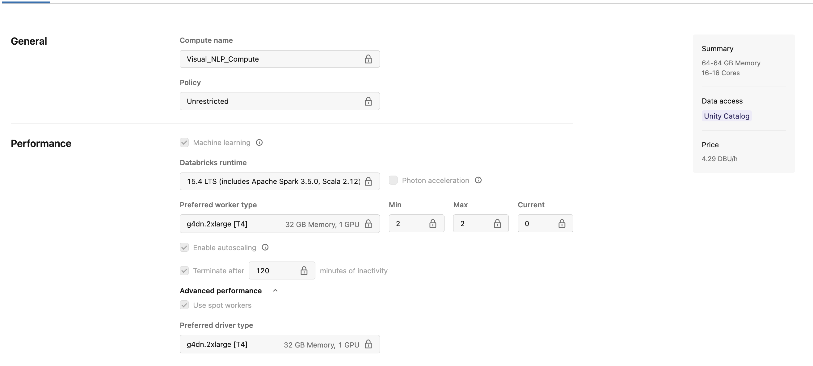
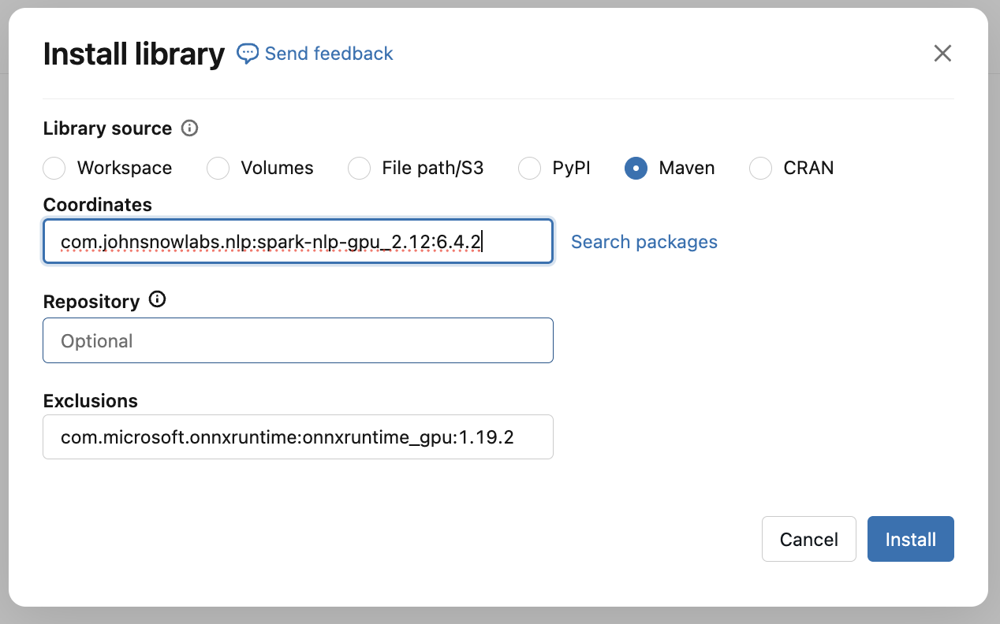
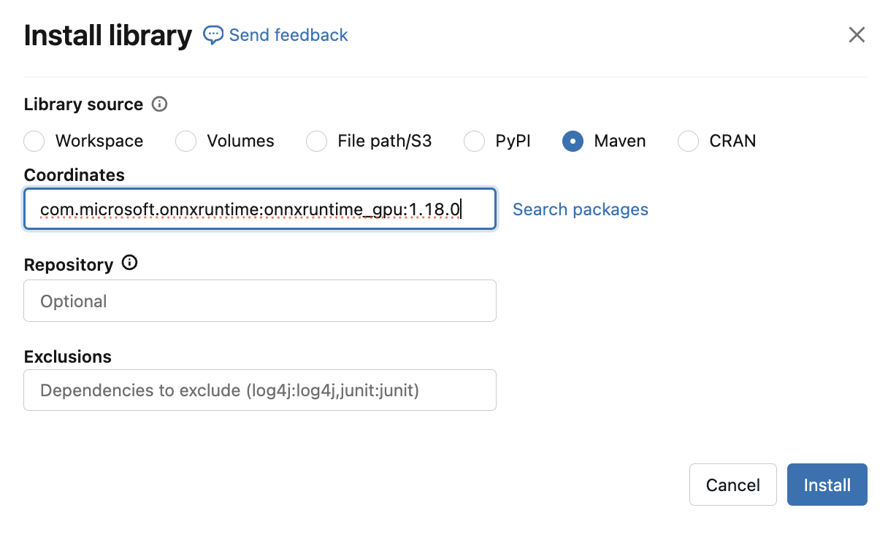
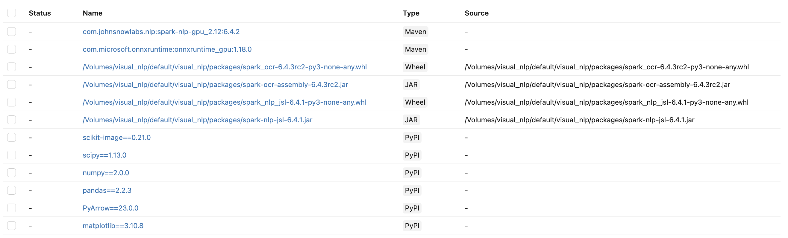
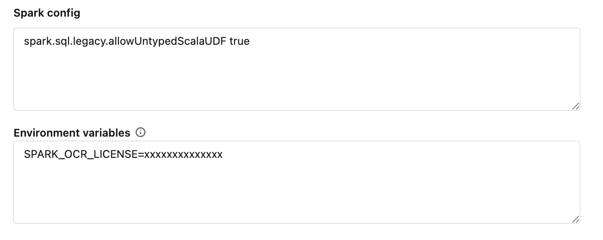

# Databricks Cluster Setup for Visual NLP / Healthcare NLP

## Supported Databricks Runtime

- Databricks Runtime: `15.4 LTS`
- GPU Runtime: `15.4 LTS GPU`

There are two ways to set up the Databricks cluster:

1. Automated setup using `VisualNLP_Cluster_Setup.ipynb`
2. Manual setup from the Databricks UI

## Option 1: Automated Setup Using Notebook

Use `VisualNLP_Cluster_Setup.ipynb` to configure your Databricks cluster from your local environment using the Databricks API.

This setup requires Databricks API tokens.

Before running the notebook, make sure you have the required license values available.

## Option 2: Manual Setup

Follow the steps below to configure the cluster manually from the Databricks UI.

### Required License Values

Check your license file for the following values:

| Placeholder | Description |
|---|---|
| `PUBLIC_VERSION` | Spark NLP version |
| `SPARK_OCR_SECRET` | Visual NLP secret |
| `OCR_VERSION` | Visual NLP version |
| `SECRET` | Healthcare NLP secret |
| `JSL_VERSION` | Healthcare NLP version |
| `AWS_ACCESS_KEY_ID` | AWS access key |
| `AWS_SECRET_ACCESS_KEY` | AWS secret key |
| `AWS_SESSION_TOKEN` | AWS session token, if required |

### Install Open Source Spark NLP

Add the following Maven coordinates:

- `com.johnsnowlabs.nlp:spark-nlp_2.12:PUBLIC_VERSION`
- `com.johnsnowlabs.nlp:spark-nlp-gpu_2.12:PUBLIC_VERSION`

Replace `PUBLIC_VERSION` with the Spark NLP version from your license file.

### GPU Runtime Note

For Databricks Runtime `15.4 LTS GPU`, exclude the packaged ONNX Runtime GPU dependency and install version `1.18.0`.

This is required because of a cuDNN version mismatch.

Exclude coordinate:

- `com.microsoft.onnxruntime:onnxruntime_gpu:1.19.2`

Additional Maven coordinate:

- `com.microsoft.onnxruntime:onnxruntime_gpu:1.18.0`

For CPU runtimes, this override is usually not required.

### Install Visual NLP

Download the Visual NLP wheel and JAR files:

- `https://pypi.johnsnowlabs.com/SPARK_OCR_SECRET/spark-ocr/spark_ocr-OCR_VERSION-py3-none-any.whl`
- `https://pypi.johnsnowlabs.com/SPARK_OCR_SECRET/jars/spark-ocr-assembly-OCR_VERSION.jar`

Replace:

- `SPARK_OCR_SECRET` with your Visual NLP secret
- `OCR_VERSION` with your Visual NLP version

Upload both files to a Databricks Volume and add them to the cluster libraries.

### Install Healthcare NLP

Download the Healthcare NLP wheel and JAR files:

- `https://pypi.johnsnowlabs.com/SECRET/spark-nlp-jsl/spark_nlp_jsl-JSL_VERSION-py3-none-any.whl`
- `https://pypi.johnsnowlabs.com/SECRET/spark-nlp-jsl-JSL_VERSION.jar`

Replace:

- `SECRET` with your Healthcare NLP secret
- `JSL_VERSION` with your Healthcare NLP version

Upload both files to a Databricks Volume and add them to the cluster libraries.

### DICOM-Related PyPI Package Overrides

For Databricks Runtime `15.4 LTS`, override the following default packages:

- `scikit-image==0.21.0`
- `scipy==1.13.0`
- `numpy==2.0.0`
- `pandas==2.2.3`
- `PyArrow==23.0.0`
- `matplotlib==3.10.8`

### Spark Configuration and Environment Variables

Depending on your license scope, the variables you need to add may change.

In this example, only the Spark OCR license is added. You may also need to add AWS credentials.

You can add either the `SPARK_OCR_LICENSE` or the Spark NLP license. Both values should be the same.

Add the following Spark configuration:

- `spark.sql.legacy.allowUntypedScalaUDF true`

Add the following environment variables:

- `SPARK_OCR_LICENSE=xxxxxxx`
- `AWS_ACCESS_KEY_ID=xxxxxxx` optional
- `AWS_SECRET_ACCESS_KEY=xxxxxxx` optional
- `AWS_SESSION_TOKEN=xxxxxxx` optional

