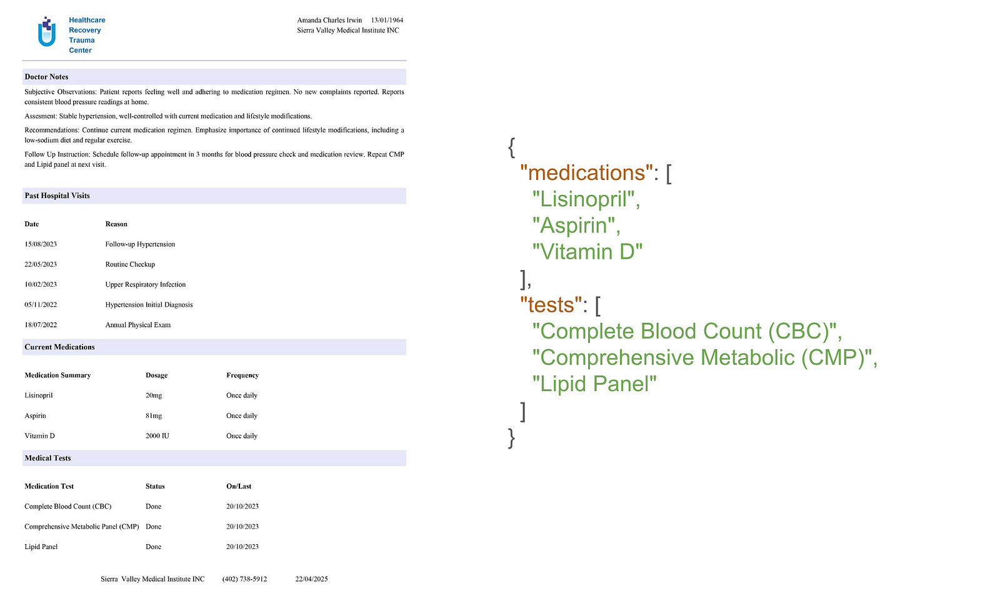
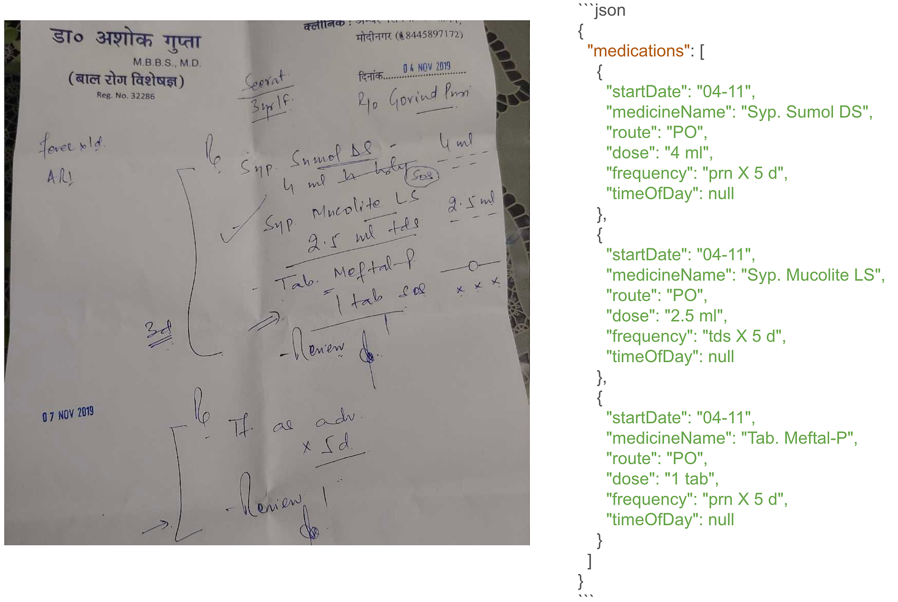

# Medical Document Datasets for Information Extraction

## Overview

This repository contains medical document datasets designed for evaluating information extraction systems. The datasets focus on extracting **medications** and **medical test information** from both **printed** and **handwritten** clinical documents under realistic conditions.

They support research in:

- Optical Character Recognition (OCR)
- Medical entity extraction
- Document understanding
- Robustness evaluation

---

## Available Datasets

The repository includes the following datasets:

- **MedJSLPrint** – Printed medical documents with data augmentation  
- **MedJSLHw** – Handwritten medical prescriptions

---

## MedJSLPrint

### Description

The **MedJSLPrint** dataset is based on **30 printed clinical documents**, expanded to **256 images** using data augmentation to simulate real-world scanning conditions.

### Image Augmentation

The following degradations were applied:

- Noise  
- Blur  
- Scanning artifacts  
- Uneven lighting  
- Degraded image quality  

### Subsets

The dataset is divided into two subsets:

#### Medication Extraction Subset
- **196 images**
- Focused on extracting medication information.

#### Medication and Medical Test Extraction Subset
- **60 images**
- Focused on extracting both medication and medical test information.

### Data Availability

Only the original, non-augmented version is publicly available in this repository.

If you require access to the **full dataset with data augmentation**, please contact **John Snow Labs**. Upon request, we can facilitate access and provide the complete version.

### Sample

A representative sample image is included in the repository.

---

## MedJSLHw

### Description

The **MedJSLHw** dataset contains **96 handwritten medical prescriptions** from Kaggle, annotated by **John Snow Labs**.

These prescriptions include realistic and often difficult-to-read handwriting.

### Characteristics

- Source: Handwritten medical prescriptions  
- Total samples: 96 documents  
- Writing style: Highly variable  
- Annotation: Medication entities  

### Purpose

This dataset is designed for evaluating extraction models on handwritten medical documents, which present challenges such as:

- Low legibility  
- Writer variability  
- Irregular layouts  
- Ambiguous characters  

### Sample

A representative sample image is included in the repository.

---

## Dataset Structure

data/
│
├── MedJSLPrint/
│ ├── medication_extraction/
│ │ ├── prescriptions/
│ │ └── samples/
│ │
│ ├── medication_test_extraction/
│ │ ├── prescriptions/
│ │ └── samples/
│
└── MedJSLHw/
├── prescriptions/
└── samples/

> **Note:** Folder names may vary depending on the repository organization.

---

## Usage

These datasets can be used for:

- Training OCR systems  
- Medical named entity recognition (NER)  
- Medication and test extraction  
- Document understanding  
- Robustness benchmarking  

Ensure your pipeline supports both printed and handwritten inputs.

---

## Citation and Credits

- **MedJSLPrint**: Augmented printed clinical documents for evaluation.  
- **MedJSLHw**: Based on Kaggle data, annotated by **John Snow Labs**.

Please cite the original sources when using these datasets.

---

## License

Refer to the repository license file for usage and distribution terms.

