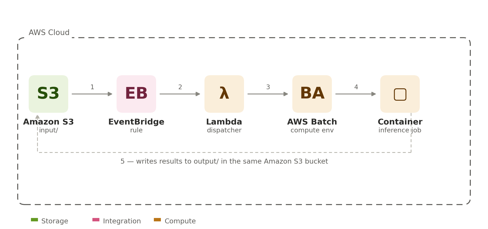

# DICOM de-identification pipeline

## Introduction
In a nutshell, this architecture works as follows,

S3 → EventBridge → Lambda → AWS Batch (EC2, `c7a.2xlarge`) → container → S3.

* S3: stores the data.
* EventBridge: notices that something happened.
* Lambda: decides what should be processed and submits a Batch job.
* AWS Batch: allocates compute and starts your container.
* A container: reads from S3, performs inference, and writes results back to S3.

Same infrastructure pattern as `../svs/`, targeting DICOM files instead of
`.svs` whole-slide images.

## Which pipeline

The container runs JSL's pretrained `dicom_deid_full_anonymization`
pipeline, baked into the image at build time by `docker/installer.py`.
It blanket-redacts every detected text region in the image rather than
drawing boxes only around NER-classified chunks, which also makes it more
robust to PHI that spans multiple text regions.

## The details
Files land under `s3://<bucket>/<folder>/`. Nothing happens until an empty
`_READY` dummy file is created under that same prefix - that triggers a Batch
job that reads `s3://<bucket>/<folder>/`, runs the DICOM de-id pipeline, and
writes results to `s3://<bucket>/<folder>_output/`. On failure, the
container writes `_FAILURE_{filename}` (with the error) to the output prefix instead.

- `docker/` — the container source (Batch entrypoint, license bootstrap).
  See `docker/README.md` for the container build details.
- `cdk/` — the CDK app that deploys everything. See `cdk/README.md` for the
  full command reference (synth, context values, teardown notes).

This file is the **ordered runbook** for a fresh deploy into an account that
has never run this before.

Summary: This runbook creates the ECR repo by hand first (step 1), pushes
the image into it (step 2), and only then deploys the CDK stack pointing at
that pre-existing repo (`-c ecr_repository_name=...`). That also means
`cdk destroy` never deletes the repo or the image — redeploying the stack
doesn't require rebuilding the container.

Every step below runs with AWS credentials for the **target** account.

## 0. Prerequisites

- AWS CLI configured for the target account (`aws sts get-caller-identity`
  to confirm).
- Docker, for building the image.
- Node.js (for `npx aws-cdk`) and Python 3.10+.
- The Visual-NLP license/keys JSON file. Required to *build* the image (step
  2, via a Docker build secret) and by the CDK stack itself (step 3, read
  locally to populate the runtime secret).
- Policies for the user: AmazonEC2ContainerRegistryFullAccess.

## 1. Create the ECR repository

```bash
aws ecr create-repository --repository-name dicom-deid-pipeline
```

Note the `repositoryUri` in the output (e.g.
`123456789012.dkr.ecr.us-east-1.amazonaws.com/dicom-deid-pipeline`).

## 2. Build and push the container image

```bash
REPO_URI=<repositoryUri from step 1>
aws ecr get-login-password --region us-east-1 | sudo docker login --username AWS --password-stdin "${REPO_URI%%/*}"

docker build --secret id=license,src=path/to/your-license.json -t dicom-deid-container docker
docker tag dicom-deid-container:latest "${REPO_URI}:latest"
docker push "${REPO_URI}:latest"
```

## 3. Bootstrap and deploy the CDK stack

```bash
cd cdk
python3 -m venv .venv && source .venv/bin/activate
pip install -r requirements.txt

npx aws-cdk bootstrap aws://<ACCOUNT_ID>/<REGION>   # once per account/region

e.g.,
npx aws-cdk bootstrap aws://123456789012/us-east-1   # once per account/region

npx aws-cdk deploy \
  -c ecr_repository_name=dicom-deid-pipeline \
  -c existing_bucket_name=my-dicom-bucket-123456789012-us-east-1 \
  -c license_file=./existing_license.json
```

The S3 bucket has two flavors, same idea as the ECR repo above:

- `-c bucket_name=<name>` — the stack creates a **new** bucket with that
  exact name (must be globally unique across all of AWS). Owned by the
  stack: destroyed on `cdk destroy`. Omit `bucket_name` entirely and CDK
  auto-generates a name instead (only discoverable from the deploy output
  afterward).
- `-c existing_bucket_name=<name>` — the stack **imports** a bucket that
  already exists (e.g. one already used by another workload). `cdk destroy`
  never touches an imported bucket. Use this one if the bucket already
  exists — passing `bucket_name` for an existing bucket fails with
  `Resource of type 'AWS::S3::Bucket' ... already exists`, since that flavor
  always tries to create a new bucket.

Pass at most one of the two.

This creates the S3 bucket, VPC, Batch compute environment/queue/job
definition (referencing the image pushed in step 2), Lambda, EventBridge
rule, and the license secret (already populated with the real
`SPARK_OCR_LICENSE` value from your license file). Note the stack outputs,
you'll need `BucketName` and `JobQueueArn`.

## 4. Test end-to-end

```bash
BUCKET=<BucketName from step 3 output>
aws s3 cp file1.dcm s3://$BUCKET/testfolder/
aws s3 cp file2.dcm s3://$BUCKET/testfolder/
aws s3api put-object --bucket $BUCKET --key testfolder/_READY --body /dev/null   # triggers the job

aws batch list-jobs --job-queue <JobQueueArn from step 3 output>
aws s3 ls s3://$BUCKET/testfolder_output/
```

## Teardown

```bash
cd cdk
npx aws-cdk destroy
```

The ECR repository from step 1 is **not** touched by `cdk destroy` (it
wasn't created by the stack) — delete it separately if you want it gone:

```bash
aws ecr delete-repository --repository-name dicom-deid-pipeline --force
```

See `cdk/README.md` for the stack-owned-repo alternative (single command,
simpler for solo iteration, but the repo/image get destroyed with the stack)
and for notes on the S3 bucket/secret removal policies.
